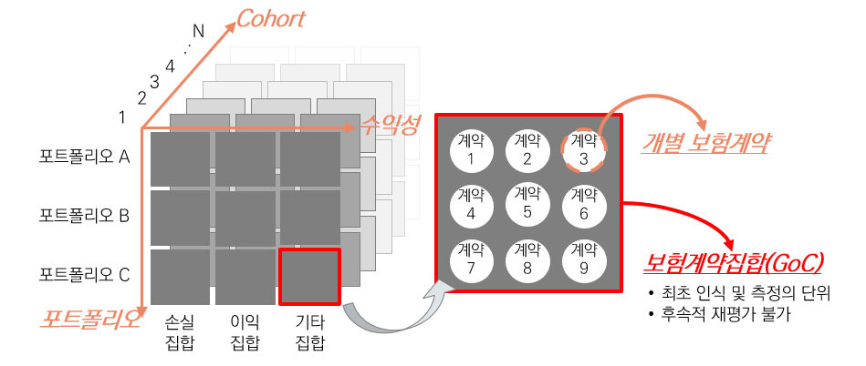
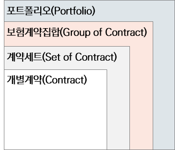

# 2.3.1 기준서 주요내용

IFRS 17에서는 발행한 계약을 개시시점에 집합으로 통합하여 IFRS 17의 인식 및 측정의 요구사항을 적용할 것을 규정함. IASB는 기업의 권리와 의무는 보험계약자와의 개별계약에서 발생하므로 계약을 개별적으로 측정하는 것도 의미가 있으나, 그러한 방식은 종종 위험을 경감시키기 위하여 많은 유사한 계약을 발행하는 기업의 보험활동에 관하여 유용한 정보를 제공하지 않을 것이므로 보험계약집합 수준에서 인식 및 측정되어야 한다고 언급함(문단 BC118). &#x20;

**보험계약집합(Group of Insurance Contract; GoC)의 통합수준은 포트폴리오, 수익성 및 Cohort에 의해서 결정**되는데, 보험계약의 포트폴리오를 식별하고 각 포트폴리오의 수익성에 따라 집합으로 나누어 개별계약을 집합 별로 통합하되, **1년 이상 간격으로 발행된 계약을 동일 집합에 포함하지 않도록** 규정함.&#x20;

따라서 보험계약집합 내 계약들은 주요 가정의 변동에 현금흐름의 금액과 시기가 유사하게 반응할 것으로 기대되는 미래 현금흐름을 가지며 유사한 기대 수익성을 가짐(문단 BC124).

또한 보험계약집합은 단일계약으로 구성될 수 있으며(문단 23), 최초인식시점에 계약의 집합을 정하고 문단 14-22를 충족한다면, 보고기간 말 후 더 많은 계약이 집합에 포함될 수 있으며, 보고기간에 보험계약집합을 인식할 때에는 문단 25에 따른 최초인식 요건 중 하나를 개별적으로 충족하는 계약만을 포함하며, 최초인식시점의 할인율과 해당 보고기간에 제공된 보장단위에 대해 추정함(문단 28). 다만 후속적으로 집합의 구성을 재평가하지 않음(문단 24). 이에 대하여 국제계리사회에서는 한 집합의 손실계약이 다른 집합의 이익계약과 상계되어 발생하는 정보의 왜곡을 방지하려는 의도라 설명함.&#x20;

또한 집합이나 포트폴리오보다 더 높은 통합수준에서 추정한 이행현금흐름을 집합에 배분하여 적절한 이행현금흐름을 측정할 수 있다면 집합이나 포트폴리오보다 더 높은 통합수준에서 이행현금흐름의 추정이 가능함(문단 24).&#x20;

## 포트폴리오

2013년 ED에서는 포트폴리오를 ‘유사한 위험에 대한 보장을 제공하고, 채택된 위험에 비례하여 유사하게 가격이 책정되며 단일집합으로 함께 관리되는 보험계약 군’으로 정의함. 그러나 동 정의가 모호하다는 다수의 견해에 따라 확정된 IFRS 17에서는 **유사한 위험에 노출되어 있고 함께 관리되는 계약을 하나의 포트폴리오로 인식하도록 규정**함.&#x20;

상품 계열 내 계약은 유사한 위험을 가질 것으로 예상되기 때문에 함께 관리된다면 같은 포트폴리오에 포함될 것으로 예상됨(문단 14). 만약 최초인식 시 개별계약이 하나의 포트폴리오에 할당되고 계약이 상이한 유형의 위험을 보장하여 분리 가능하다면, 다수의 포트폴리오에 배분될 수 있음.  &#x20;

## 수익성

문단 16에 따라 발행한 보험계약의 포트폴리오는 최소한 다음과 같은 세 가지의 집합으로 나눌 것을 제시함.&#x20;


**수익성 구분**

* (있다면) 최초인식시점에 손실을 부담하는 계약
* (있다면) 최초인식시점에 후속적으로 손실을 부담하게 될 유의적인 가능성이 없는 계약 집합&#x20;
* (있다면) 포트폴리오에 남아있는 계약집합


최초인식시점에 손실부담계약을 식별하도록 하는 요구사항의 목적은 개별계약으로 측정했을 때 손실부담계약인 계약을 식별하는 것이나, IASB는 반드시 개별적으로 측정되어야 하는 것을 의미하는 것은 아니라고 결론을 내림(문단 BC129). 합리적으로 뒷받침 될 수 있는 정보를 이용하여 계약 세트(set of contracts)가 같은 집합에 모두 포함될 것이라고 결론을 내릴 수 있다면, 계약 세트를 기준으로 측정할 수 있으며 계약이 후속적으로 손실을 부담하게 될 유의적 가능성이 없는지에 대한 결정도 계약세트로 평가할 수 있음. 단, 계약 세트가 같은 집합에 모두 포함될 것이라고 결론 내리는데 합리적이고 뒷받침될 수 있는 정보를 가지고 있지 않다면 개별 계약을 검토하여 해당 계약이 어떤 집합에 포함될 지 결정해야 함(문단 17).  &#x20;

계약 혹은 계약세트가 최초인식시점에 손실부담계약인지 식별하기 위해서는 IFRS 17의 측정 요구사항을 적용해야 함. 문단 47에 따르면 보험계약에 배분된 이행현금흐름, 이전에 인식한 인수 현금흐름 및 최초 인식시점에 계약에서 생기는 현금흐름의 총계가 순유출인 경우 최초인식시점에 보험계약을 손실부담계약 분류하며 그러한 계약은 손실부담이 아닌 계약과 구분하여 분류할 것을 제시함.  &#x20;

최초인식시점에 손실부담계약이 아닌 계약이 후속적으로 손실부담계약이 될 유의적 가능성은 기준서 문단 19에 따라 다음과 같이 평가함.


**손실부담계약이 될 유의적 가능성**

* 가정이 변동한다면 계약이 손실부담계약이 될 가정의 변동 가능성에 근거하여 평가함.&#x20;
* 기업의 내부보고에서 제시한 추정치에 대한 정보를 사용하되 추가 정보를 수집할 필요는 없으며, 해당계약이 손실부담계약이 될 가능성에 영향을 주는 다른 계약의 가정변동에 관한 내부 정보도 고려해야 함.



기준서에서는 문단 16에 기술된 것보다 더 많은 집합으로 세분화(문단 21) 할 수 있음을 제시함. 수익성 수준의 차이 및 최초인식 이후 손실부담계약이 될 가능성의 차이가 구분되는 기업의 내부보고 정보가 제공된다면 최초 인식시점에 손실부담계약이 아닌 더 많은 집합으로 포트폴리오를 나눌 수 있음. 또한 내부보고에서 계약이 손실을 부담하는 정도에 대해 보다 세밀한 수준으로 정보를 제공하는 경우, 최초인식시점에 손실부담계약인 계약들을 복수의 집합으로 나눌 수 있음. 다만, IASB는 보험 영업의 본질과 반대되는 과도한 수익성 세분화를 염려하였으며, 기업에 의해 동일한 기준에서 가격이 정해진 계약이 다른 집합에 포함되지 않을 것이라 언급함(문단 BC135).&#x20;

한편, 문단 18에서는 보험료배분접근법을 적용하는 보험계약의 경우 포트폴리오에 포함되는 계약은 최초인식시점에 손실부담이 아니라고 가정하되, 사실과 상황이 이와 다르게 나타나는 경우 그렇게 가정하지 않으며, 사실과 상황의 변경 가능성을 평가하여 후속적으로 손실부담계약이 될 유의적인 가능성이 없는지 평가함. 최초인식시점에 손실부담이 아니라고 가정하므로 손실부담계약집합으로 구분하지 않으며, 사실과 상황의 변경가능성을 평가하여 후속적으로 손실을 부담하게 될 유의적인 가능성이 없는 계약집합과 포트폴리오에 남아있는 계약집합으로 구분함에 따라 보험료배분접근법을 적용하는 보험계약의 포트폴리오는 최소 두 가지의 집합으로 나뉨.   &#x20;

## Cohort

IFRS 17에서는 **발행시점의 차이가 1년을 초과하는 계약을 같은 집합 내에 포함시키지 않도록 규정**함(문단 22). IASB는 시간의 경과에 따른 수익성의 변화에 관한 정보가 소실될 수 있으며, 보험계약마진이 집합 내 계약의 듀레이션을 초과하여 남아있게 될 수 있어 보험계약마진이 올바른 기간에 이익으로 인식되지 않게 될 수 있음을 우려하였으며, 포트폴리오의 수익성 추세를 적시에 재무제표에 반영하기 위해서는 같은 집합 내 발행시점의 차이가 1년을 초과하는 계약을 포함시킬 수 없다고 결정함(문단 BC136).
