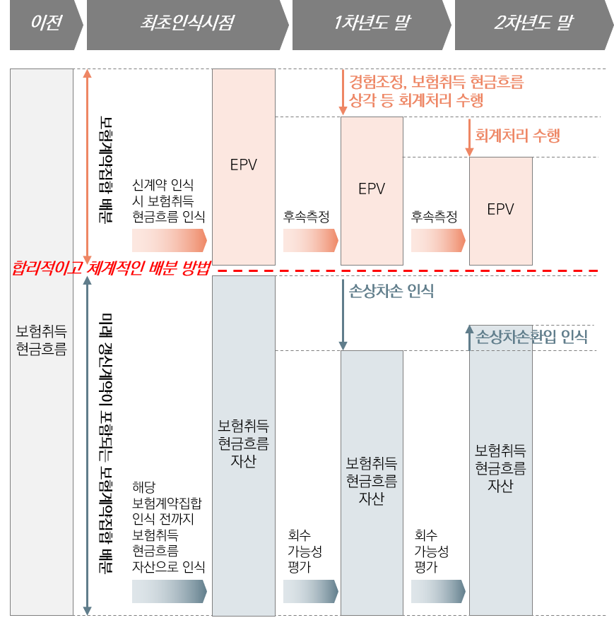

# 3.1.1 기준서 주요내용

문단 25에서는 보험계약집합의 최초인식시점에 대해 정의하였으며, 기업은 다음 중 가장 이른 시점에 발행한 보험계약집합을 인식해야 함.


**최초인식일**

* 보험계약집합의 보장기간이 시작될 때&#x20;
* 집합 내의 보험계약자가 첫 번째 보험료를 지급해야 할 때
* 집합이 손실부담계약 집합이 되는 때&#x20;


일반적으로 최초 보험료는 보장기간의 개시시점에 지급해야 하므로 그 시점에 보험계약집합을 인식하나, 계약상 지급해야 하는 날이 없는 경우에는 계약자로부터 첫 번째 보험료를 받는 날을 지급해야 하는 날로 간주함. 사실과 상황이 손실부담계약집합이 존재한다는 것을 나타내는 경우에는 보장기간의 시작할 때 혹은 첫 번째 보험료를 받을 때보다 더 먼저 어느 계약이 손실부담계약에 해당하는지에 대한 결정이 우선되어야 함(문단 26).&#x20;

다만, 재량적 참가특성이 있는 투자계약에 대해서는 유의적인 보험위험의 이전이 없기 때문에, 최초인식시점에 대한 요구사항을 수정하여 최초인식시점을 계약 당사자가 되는 때로 정의함(문단 71).

한편, 기준서는 집합의 최초인식 이전에 지급한 보험취득 현금흐름을 체계적이고 합리적인 기준을 적용하여 보험계약집합과 미래 갱신계약이 포함된 보험계약집합으로 배분할 것을 규정함(문단 28A, B35A\~B35B). 보험계약집합의 최초인식 이전에 지급한 보험취득 현금흐름에 대해서는 자산으로 인식하되, 보험취득 현금흐름이 배분된 현재 혹은 미래 보험계약집합 별로 인식하며(문단 28B), 관련 보험계약집합의 인식시점에 보험취득 현금흐름 자산을 제거하여 이행현금흐름으로 대체할 것을 제시함(문단28C).&#x20;


또한 보고기간 후 보험계약집합에 계약이 추가되었을 경우, 해당기간에 추가된 보험계약과 관련된 비율만큼 보험취득 현금흐름 자산을 제거하고 미래 보고기간에 집합에 추가될 것으로 예상되는 보험취득 현금흐름 자산을 계속 인식해야 함(문단 28D, B35C).

만약, 보험취득 현금흐름 자산이 손상되었음을 나타내는 사실과 상황이 존재하는 경우 회수가능성을 평가하여 손상차손 혹은 손상차손환입을 인식해야 하는데, 이는 매 보고기간 말 평가해야 함 (문단 28E, 28F, B35D).&#x20;


**보험취득 현금흐름 회수가능성 평가**

* 매 보고기간 말 회수가능성을 평가하여 손상차손이 발생한다면, 자산의 장부금액을 조정하고 손상차손을 당기손익으로 인식
* 손상조건이 더 이상 존재하지 않거나 개선되었다면, 손상차손환입 인식

