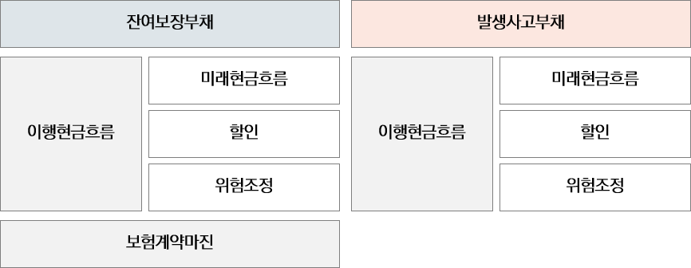
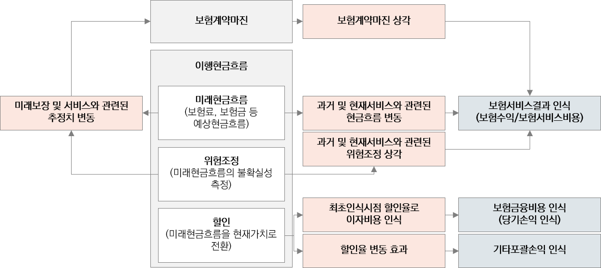
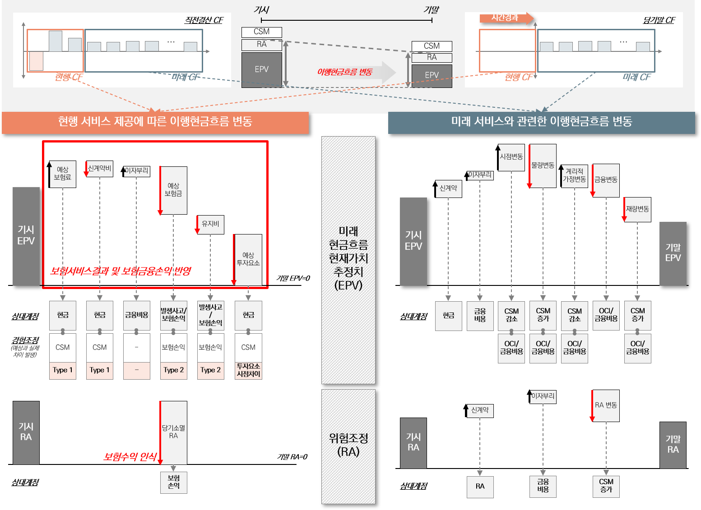
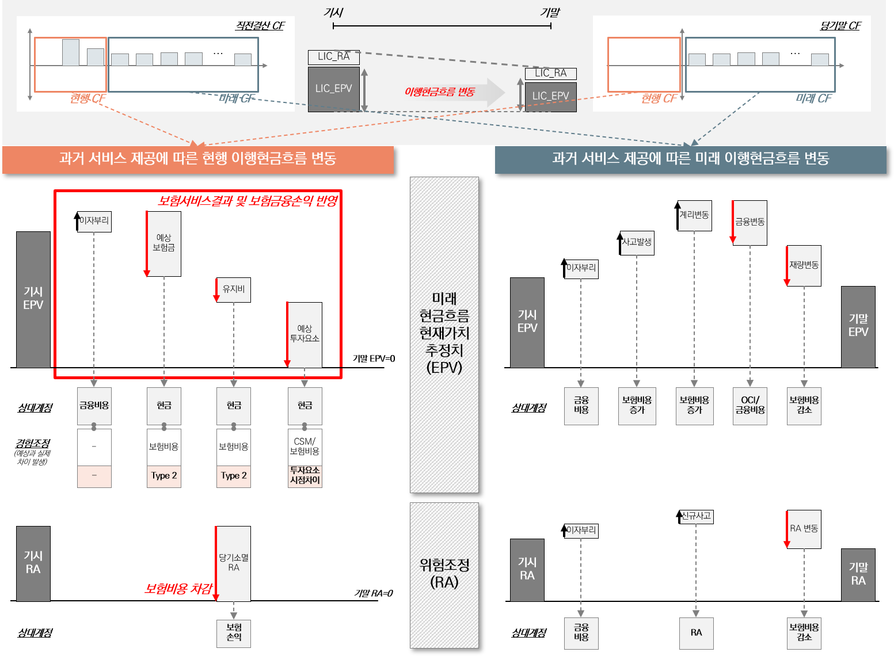

# 4.1.1 기준서 주요내용

문단 40에 따라 매 보고기간 말 보험계약집합의 장부금액은 다음의 합계로 구성됨.&#x20;


**잔여 보장에 대한 부채(**[_**잔여보장부채**_](4.1.1.md#undefined)**; Liability for remaining coverage)**

보고기간 말 시점에 집합에 배분된 **미래 서비스와 관련된 이행현금흐름**

* 보고기간 말 시점에 추정된 미래 현금흐름과 현행할인율을 이용하여 미래 현금흐름의 현재가치 추정치를 측정함(문단 33\~36).
* 최초측정 시 적용했던 신뢰수준법, 자본비용법 등의 추정기법으로 보고기간 말 위험조정을 추정함(문단 37).&#x20;

보고기간 말 시점의 **집합의 보험계약마진**

* 최초인식 한 보험계약마진 장부금액에서 후속적인 변동분을 조정함(문단 44).&#x20;



**발생한 보험금에 대한 부채(**[_**발생사고부채**_](4.1.1.md#undefined-1)**; Liability for incurred claims)**

보고기간 말 시점에 집합에 배분된 **과거 서비스와 관련된 이행현금흐름**

* 보고기간 말 시점에 추정된 미래 현금흐름과 현행할인율을 이용하여 미래 현금흐름의 현재가치 추정치를 측정함(문단 33\~36).
* 최초측정 시 적용했던 신뢰수준법, 자본비용법 등의 추정기법으로 보고기간 말 위험조정을 추정함(문단 37).&#x20;



기준서에서 규정한 후속측정은 잔여보장부채와 발생사고부채의 이행현금흐름을 구성하는 기대현금흐름과 할인율, 그리고 위험조정을 보고기간 말 현행 가정과 할인율을 이용하여 측정 한 후, 기초금액과 비교하여 변동된 금액을 IFRS 17 기준에 따라 수익과 비용으로 인식하는 것을 원칙으로 함. 문단 44와 문단 B96\~B97에서는 과거 및 현재 서비스와 관련된 변동과 미래 보장 및 서비스와 관련된 변동을 구분하여 회계처리 할 것을 제시하였으며, 변동 및 손익인식의 원칙은 다음의 그림과 같음.&#x20;

## 잔여보장부채

잔여보장부채는 아직 발생하지 않은 보험사건에 대해 현재의 보험계약에 따라 조사하고 타당한 보험금을 지급할 의무 즉, 보장기간 중 만료되지 않은 기간과 관련이 있는 의무를 의미하며, 미래 보험계약서비스에 대한 의무 및 보험계약서비스 제공과 관련이 없으나 발생사고부채로 이전되지 않은 모든 투자요소 혹은 기타의무를 포함하도록 정의함(부록 A 용어의 정의). &#x20;

### 당기손익으로 인식하는 이행현금흐름의 변동&#x20;

문단 33\~37과 문단 B36\~B92를 적용하여 보고기간 말에 측정한 잔여보장부채의 이행현금흐름의 변동분은 문단 41에 따라 수익과 비용으로 인식함. 다만, 문단 81에 따라 비금융위험에 대한 위험조정의 변동분을 보험서비스결과와 보험금융손익으로 세분화 할 필요는 없으며, 세분화하지 않을 경우에는 비금융위험에 대한 위험조정의 전체 변동분을 보험서비스결과의 일부로 포함시킴.&#x20;

#### 1) 보험수익&#xD;

**해당 기간의 서비스의 제공에 따른 잔여보장부채의 감소분**을 적용하여 측정하는 보험수익은 보험계약집합에서 발생하는 보장 및 기타 서비스를 제공하고 그러한 서비스에 대한 교환으로 받을 것으로 기대하는 대가를 반영하는 금액(문단 83)임. IFRS 15에 따라 기업이 서비스를 제공한 때 그러한 서비스의 수행의무를 제거하고 수익을 인식함.&#x20;

다만, 투자요소와 문단 83에 부합하지 않는 보험료의 경우에는 기업의 서비스를 제공 시 보험수익과 보험서비스비용으로 인식하지 않음.

IFRS 15에 따라 기업이 서비스를 해당 기간에 제공한 때, 제공되는 서비스에 대한 잔여보장부채를 감소시키고 보험수익을 인식하며, 보험수익을 발생시키는 잔여보장부채의 감소에 해당하는 변동은 기업이 수취하는 대가에 따라 보장될 것으로 기대되는 서비스와 관련 없는 **다음과 같은 부채의 변동은 제외**함(문단 B123).


**보험수익 인식이 불가능한 부채변동**

* 해당기간에 제공되는 서비스와 관련이 없는 변동&#x20;
  * 수취한 보험료로 인한 현금유입에서 생기는 변동
  * 해당 기간에 투자요소와 관련된 변동&#x20;
  * 보험계약대출에서 발생한 현금흐름으로 인한 변동&#x20;
  * 제3자를 대신하여 수취한 거래 기반 세금과 관련된 변동&#x20;
  * 보험금융수익(비용)&#x20;
  * 보험취득 현금흐름
  * 제3자 이전으로 인한 부채의 제거
* 서비스와 관련된 변동이지만 기업이 대가를 기대하지 않는 경우. 즉, 잔여보장부채의 손실요소 증감(문단 47-52 참조)


결과적으로 해당기간의 보험수익은 기업이 대가를 수취할 것으로 기대하는 서비스와 관련된 해당기간의 잔여보장부채의 총변동을 의미함(문단B124).

* 해당기간에 발생한 보험서비스비용(예상금액)으로 손실요소에 배분한 금액 및 투자요소 상환액을 제외함
* 비금융위험에 대한 위험조정의 변동으로 보험금융수익에 포함된 변동이나 미래 서비스와 관련되어 보험계약마진에서 조정한 변동, 손실요소에 배분한 금액 등은 제외함&#x20;

#### 2) 보험서비스비용&#xD;

손실부담계약집합의 손실과 손실의 환입은 보험서비스비용으로 인식함(문단 47\~52 참조).&#x20;

#### 3) 보험금융수익(비용)&#xD;

문단 87에 명시된 것과 같이 화폐의 시간가치 효과와 금융위험 효과에서 발생하는 보험계약집합의 장부금액 변동으로 당기에 인식해야 할 총 보험금융수익(비용) 금액은 당기손익에 표시하거나 당기손익과 기타포괄손익으로 나누어 인식할 수 있으며(문단 88), 이는 선택 가능한 회계정책으로 보험계약 포트폴리오에 적용함(문단 90, B129).


**보험금융손익 인식 관련 회계정책**&#x20;

* 해당 기간의 보험금융수익(비용)을 당기손익에 포함&#x20;
* 예상되는 총보험금융수익(비용)을 계약집합의 듀레이션에 걸쳐 체계적으로 배분하여 산정한 금액을 당기손익에 포함시키도록 세분화함&#x20;


문단 88(2)에서 언급하는 체계적 배분이란 집합의 듀레이션에 걸쳐 보험계약집합의 총 기대금융수익(비용)을 다음과 같이 배분하는 것임(문단 B130).

* 계약의 특성에 기반하여, 계약에 따라 발생할 것으로 예상되는 현금흐름에 영향을 주지 않는 요소는 참조하지 않음.&#x20;
  * 예를 들어, 만약 인식될 것으로 기대되는 자산의 이익이 집합 내의 계약 현금흐름에 영향을 미치지 않는다면, 금융수익(비용)을 인식될 것으로 기대되는 그 이익에 기반하여 배분해서는 안됨. &#x20;
* 계약집합의 듀레이션에 걸쳐 기타포괄이익으로 인식되는 금액의 총합은 영(0)이며, 어느 일자 기준으로도 기타포괄이익으로 인식된 누적금액은 계약집합의 장부금액과 체계적 배분을 적용했을 때 측정되었을 계약집합의 금액의 차이임.&#x20;

체계적 배분을 결정할 때 적용할인율은 다음과 같음.


**체계적 배분 시 적용 할인율**

*   금융위험과 관련된 가정 변동이 계약자에게 지급되는 금액에 상당한 영향을 미치지 않아 **Non Par 모형을 적용하는 보험계약집합**의 경우(문단 B131) &#x20;

    * 문단 B72(5)(가)에서 명시한 할인율을 사용하여 결정
    * 어떠한 기초항목의 성과에도 연동되지 않은 명목현금흐름에 문단 36을 적용하여 계약집합의 최초인식시점에 결정된 할인율을 사용함.&#x20;

* 금융위험과 관련된 가정 변동이 계약자에게 지급되는 금액에 상당한 영향을 미쳐 **In Par 모형을 적용하는 보험계약집합**의 경우(문단 B132)&#x20;
  * 문단 B72(5)(나)에 따라 계약집합의 잔여 듀레이션에 걸쳐 수정된 잔여 기대금융수익(비용)을 단일률로 사용하여 배분하거나(유효수익률법), 보험계약자에게 지급해야 하는 금액을 결정하기 위해 부리이율을 사용하는 계약의 경우에는 당기에 부리되는 금액과 미래기간에 부리될 것으로 기대되는 금액에 기초하여 배분함(예상부리이율법).&#x20;
  * 만약 문단 81을 적용하여 비금융위험에 대한 위험조정에서 발생하는 금융수익(비용)을 그 밖의 변동에서 별도로 구분한다면, 비금융위험에 대한 위험조정에서 발생하는 금융수익(비용)의 체계적인 배분은 미래현금흐름에서 발생한 금융수익(비용)을 배분할 때 사용하는 방식과 일관된 방식으로 결정함.


### 보험계약마진으로 인식하는 이행현금흐름의 변동분&#x20;


해당 기간의 서비스 제공에 따른 잔여보장부채의 이행현금흐름의 변동은 보험수익 혹은 보험서비스비용, 보험금융수익(비용)으로 인식하나, 문단 44(3)에 따라 미래 서비스와 관련된 이행현금흐름의 변동분은 보험계약마진으로 인식함. IASB는 다음과 같은 이유에서 미래 서비스와 관련된 이행현금흐름의 추정치 변동을 보험계약마진의 측정치에서 갱신할 것을 요구함(문단 BC223).&#x20;

* 미래 서비스와 관련된 이행현금흐름 추정치의 변동은 보험계약집합의 미래 수익성에 영향을 미침.&#x20;
  * 따라서 이러한 변동을 반영하여 보험계약마진을 조정하면, 보험계약마진을 조정하지 않는 것에 비해 최초인식 이후 보험계약집합의 잔여 미실현이익에 관한 보다 목적적합한 정보를 제공하게 됨&#x20;
* 최초인식시점의 측정과 후속측정 간의 일관성이 증가함. 만약 미래 서비스와 관련된 추정치 변동을 보험계약마진에서 조정하지 않는다면, 최초인식시점의 추정치는 보험계약마진을 결정하지만, 후속적인 추정치의 변동은 그렇지 않게 되어 일관성이 저하됨. &#x20;

따라서 IASB는 미래 서비스에 관련된 이행현금흐름 추정치의 변동을 보험계약마진에서 조정해야 한다고 결론 지은 후, 문단 B96을 통해 미래 서비스와 관련된 이행현금흐름의 변동분을 보험계약집합의 보험계약마진으로 조정하는 항목을 규정함. &#x20;


**보험계약마진을 조정하는 미래서비스 관련 이행현금흐름 추정치의 변동**

* 미래 서비스와 관련하여 **해당 기간에 수취한 보험료 및 관련 현금흐름**
  * 예: 보험취득 현금흐름, 보험료 기반 세금에서 발생한 경험조정. 이는 문단 B72(3)에서 정한 최초인식시점 할인율로 측정함.
* **잔여보장부채의 미래현금흐름 현재가치 추정치의 변동**.&#x20;
  * 이는 문단 B72(3)에서 정한 최초인식시점 할인율로 측정함.
* **해당기간에 지급될 것으로 예상된 투자요소 및 보험계약대출과 해당기간에 지급/상환될 실제 투자요소 및 보험계약대출과의 차이**.&#x20;
  * 이는 문단 B73(3)에서 정한 최초인식시점 할인율로 측정함.&#x20;
  * 단, 문단 B97(1)에서 기술한 화폐의 시간가치 및 금융위험 변동으로 인한 투자요소 및 보험계약대출의 예상과 실제 차이는 보험계약마진으로 조정하지 않음
* **미래 서비스와 관련된 비금융위험에 대한 위험조정의 변동**



IASB는 보험계약마진 자체 내의 일관성을 위해 **미래 현금흐름의 추정의 변경을 조정**하는 것도 **최초인식시점에 적용된 할인율로 측정**되어야 한다고 결론을 내림. 이에 따라 이행현금흐름의 변동과 보험계약마진의 조정 간의 차이, 즉 **현행할인율로 측정된 미래 현금흐름의 변동과 최초인식시점에 적용된 할인율로 측정된 미래현금흐름 변동의 차이가 발생**하며, 이러한 차이는 **보험금융비용 표시**를 위해 기업이 **선택한 회계정책에 따라 당기손익 또는 기타포괄손익**에 포함되는 손익을 증가시킴(문단 BC275)

한편, IFRS 17에서 경험조정이란 다음 항목들의 차이를 의미(부록 A)하는데, 문단 B96(1)에서 언급하고 있는 미래 서비스와 관련하여 해당기간에 수취한 보험료 및 관련 현금흐름에서 발생한 경험조정은 보험계약마진으로 인식하고, 보험서비스비용과 관련된 경험조정은 당기 손익으로 인식함. &#x20;


**경험조정**

**1) 보험료 수취**(그리고 보험 취득현금흐름과 보험료 관련 세금과 같은 관련 현금흐름)**와 관련**하여 해당 기간에 예상되는 금액에 대한 해당 기간 초의 추정치와 해당 기간의 실제 현금흐름
****&#x20;

* 일반적으로 경험조정은 당기 또는 과거 서비스와 관련되어 있고 반대로 미래 현금흐름의 추정 변동은 미래 서비스와 관련된다고 가정함.
* 단, IASB는 미래 보장에 대해 **수취한 보험료와 관련된 경험조정이 미래 서비스와 관련** 있으며, 이는 일반적인 규칙의 예외라고 설명함. &#x20;

**2) 보험서비스비용(보험인수비용은 제외)**과 관련하여 해당 기간에 발생할 것으로 예상되는 금액에 대한 해당기간 초의 추정치와 해당 기간에 실제 발생한 금액&#x20;


단, 문단 B97에 따라 이행현금흐름 변동 중 미래 서비스와 관련이 없어 보험계약마진에서 조정하지 않는 항목이 있는데, 화폐의 시간가치 및 금융위험의 변동, 발생사고부채의 이행현금흐름 추정치의 변동, 그리고 앞서 언급한 보험서비스비용과 관련된 경험조정이 해당함.&#x20;


**보험계약마진을 조정하지 않는 항목**&#x20;

다음의 이행현금흐름의 변동은 미래 서비스와 관련이 없기 때문에 보험계약마진에서 조정하지 않음.&#x20;

* 화폐의 시간가치 및 그 변동의 효과와 금융위험 및 그 변동의 효과&#x20;
  * 효과가 있다면, 미래 현금흐름 추정에 미친 효과
  * 비금융위험에 대한 위험조정에 미친 효과&#x20;
  * 할인율 변동 효과&#x20;
* 발생사고부채의 이행현금흐름 추정치의 변동&#x20;
* 문단 96(1)에 기술된 미래 서비스와 관련되는 보험료 및 관련 현금흐름에 대한 경험조정 &#x20;



금융위험과 관련된 가정의 변경으로 인한 미래 이행현금흐름의 변동은 계약 개시시점에 기업의 확약에 미치는 효과와 재량의 변경이 그 확약에 미치는 효과를 구별하여 보험금융수익(비용)이나 보험계약마진을 조정해야 함(문단 B99). 기준서 문단 B98에서는 일부 보험계약의 조건에 따라 보험계약자에게 지급할 현금흐름에 대한 재량이 부여되어 있을 수 있는데, 해당 재량 현금흐름의 변동은 미래서비스와 관련된 것으로 간주하고 보험계약마진으로 조정할 것을 규정함. 다만, 재량 현금흐름의 변동을 식별하는 방법을 결정하기 위해 계약 개시 시점에 계약상 기업의 확약을 결정할 것으로 기대하는 근거를 명시함. 만약 계약의 개시시점에 계약상 기업의 확약으로 간주되는 부분과 재량으로 간주되는 부분을 특정할 수 없다면 계약 개시 시점에 이행현금흐름의 추정치에 내재된 이익을 확약된 것으로 간주하고 이를 금융위험과 관련된 현행가정을 반영하기 위해 갱신해야 함(문단B100).

이상의 잔여보장부채의 이행현금흐름 변동에 대한 회계처리 원칙을 정리하면 다음의 그림과 같음.

## 발생사고부채

발생사고부채는 이미 발생한 보험사건에 대해 조사하고 정당한 보험금과 기타 발생한 보험비용을 지급할 의무로 발생한 보험사건에는 발생하였으나 해당 보험금은 아직 보고되지 않은 사건도 포함됨(부록 A 용어의 정의). &#x20;

문단 33\~37과 문단 B36\~B92를 적용하여 보고기간 말에 측정한 발생사고부채의 이행현금흐름의 변동분은 문단 42에 따라 수익과 비용으로 인식하며, 문단 B97에 따라 미래 서비스와 관련이 없어 보험계약마진에서 조정하지 않음.&#x20;

#### 1) 보험서비스비용&#xD;

해당 기간에 발생한 보험금과 비용으로 인한 부채의 증가분(투자요소는 제외)과 발생한 보험금 및 비용과 관련된 이행현금흐름의 후속 변동분
은 보험서비스비용으로 인식함.&#x20;

문단 84에 따라 발행한 보험계약집합에서 생기는 보험서비스비용은 당기손익으로 표시하며, 발생한 보험금(투자요소의 상환 제외), 발생한 기타 보험서비스 비용 및 문단 103(2)에 기술된 그 밖의 금액으로 구성됨  &#x20;


보험서비스비용 항목(문단 103(2))

* 발생한 보험금(투자요소 제외) 및 기타 발생한 보험서비스비용&#x20;
* 보험취득 현금흐름의 상각&#x20;
* 과거 서비스와 관련된 변동분. 즉 발생사고부채와 관련된 이행현금흐름의 후속 변동분&#x20;
* 미래 서비스와 관련된 변동분. 즉 손실부담계약 집합이 손실 및 그러한 손실의 환입&#x20;
  &#x20;


#### &#xD;2\) 보험금융수익(비용)&#xD;

문단 87에 명시된 것과 같이 화폐의 시간가치 효과와 금융위험 효과에서 발생하는 보험계약집합의 장부금액 변동은 보험금융수익(비용)으로 인식함.&#x20;

당기에 인식해야 할 총 보험금융수익(비용) 금액은 당기손익에 표시하거나 당기손익과 기타포괄손익으로 나누어 인식할 수 있으며(문단 88), 이는 선택 가능한 회계정책으로 보험계약 포트폴리오에 적용함(문단 90, B129).


**보험금융손익 인식 관련 회계정책**

* 해당 기간의 보험금융수익(비용)을 당기손익에 포함&#x20;
* 예상되는 총보험금융수익(비용)을 계약 집합의 듀레이션에 걸쳐 체계적으로 배분하여 산정한 금액을 당기손익에 포함시키도록 세분



이상의 발생사고부채의 이행현금흐름 변동에 대한 회계처리 원칙을 정리하면 다음의 그림과 같음.

