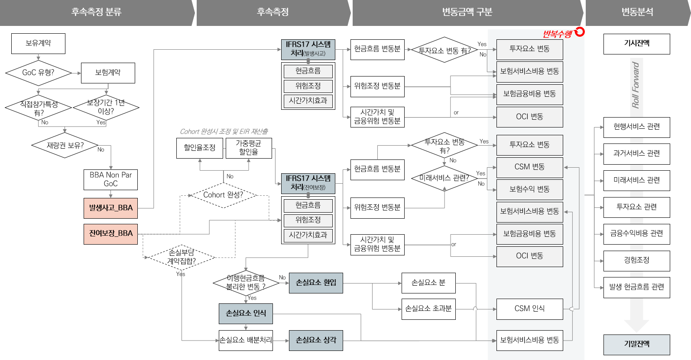

# 4.후속측정

IFRS 17 프로세스 중 후속측정과 관련한 프로세스는 보험계약 유형과 회계모형에 따라 상이함. 기준서 문단 3에 따라 IFRS 17의 적용범위에 포함되는 일반 보험계약, 재보험계약, 그리고 재량적 참가특성이 있는 투자계약은 서로 다른 계약특성으로 인하여 측정 및 회계처리 기준이 상이하며, 기준서에서 보험계약의 형태에 따라 측정모형으로 제시한 일반모형, 보험료배분접근법 그리고 변동수수료접근법도 각 모형에 따라 측정방법 및 회계처리 기준에 차이가 있음. 따라서 후속측정을 위한 프로세스는 먼저 보험계약집합 유형에 따른 후속측정의 분류가 선행되어야 함. &#x20;

4장 후속측정에서는 후속측정 분류에 따라 **일반모형으로 측정되는 일반 보험계약의 후속측정**에 대해 서술함. 이외 재보험계약의 후속측정 프로세스는  7장에서 기술하며, 일반모형을 제외한 보험료배분접근법, 변동수수료접근법의 프로세스는 각각 5장, 6장에서 제시함. &#x20;

일반모형을 적용하는 보험계약집합은 금융위험과 관련된 가정의 변동이 보험계약자의 지급액에 미치는 영향도에 따라 Non Par 모형과 Indirect Par 모형으로 구분되며, 각각의 후속측정 프로세스는 다음과 같음. &#x20;


* **후속측정 분류**: 보험계약 유형과 회계모형에 따른 분류&#x20;
* **후속측정**: 매 보고기간 말 [_**잔여보장부채**_](4.1./4.1.1.md#undefined) __ 및 [_**발생사고부채**_ ](4.1./4.1.1.md#undefined-1)측정
* **변동금액 구분**: 기준서에서 규정한 잔여보장부채 및 발생사고부채 변동금액의 수익 혹은 비용 구분인식&#x20;
* **변동분석:** 기초잔액에서부터 기말잔액까지의 변동금액에 대한 차이조정 및 분석 &#x20;


