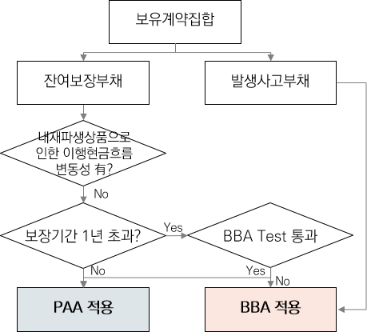

# 5.1.1 기준서 주요내용

기준서는 문단 53을 통해 다음의 경우에만 집합의 개시시점에 보험료배분접근법을 적용할 것을 제시하였으며, 이 방법을 적용하더라도 발생사고부채는 일부 예외사항을 제외하고 일반모형을 사용하여 측정해야 함.&#x20;


**보험료배분접근법 적용조건(문단 53)**

* 집합 내 각 계약(최초인식시점에 결정된 계약의 경계 내의 모든 보험료에서 생기는 보험계약서비스 포함)의 보험계약서비스 기간 1년 이하&#x20;
* 보험료배분접근법을 사용하여 측정한 잔여보장부채가 일반모형으로 측정한 결과와 중요하게 다르지 않을 것으로 합리적으로 기대하는 경우(BBA Test 통과)
  * 다만, 계약집합 개시 시점에 내재파생상품과 계약집합의 보장기간으로 인하여 보험금 발생 이전 기간에 이행현금흐름의 유의적인 변동이 있는 것으로 예상되는 경우에는 해당 조건을 충족시키지 못함(문단 54).&#x20;


IASB는 보험료배분접근법이 IFRS 17의 일반적인 요구사항에 대한 타당한 근사치를 제공할 때, 기업이 보험료배분접근법을 적용하는 것이 요구되지는 않지만 허용되어야 한다고 결정함. IASB는 보험료배분접근법을 일반적인 요구사항의 간소화로 여기며, 집합 내 각 계약의 보장기간이 1년 이하이면, 기업은 추가적인 조사없이 보험료배분접근법이 IFRS 17의 일반적인 요구사항에 대해 타당한 근사치를 제공한다고 가정할 수 있는 지침을 제공하기로 결정함(문단 BC291).

한편, 기준서에서는 보험료배분접근법에 대한 통합수준을 특별히 언급하고 있지는 않으나, 통합수준 기준 중 수익성 구분기준(문단 18)이 일반모형과 일부 상이한 부분이 있으며 포트폴리오 식별과 Cohort 설정 기준은 일반모형의 기준과의 일관성을 유지할 필요가 있음.&#x20;


**보험료배분접근법 적용 시 통합수준 기준**&#x20;

* **포트폴리오 식별**&#x20;
  * 기준서 상 특별한 기준이 제시되어 있지 않으므로 일반모형과 동일한 기준 적용 가능&#x20;
  * 단, 보험료배분접근법의 수익성 판단기준이 일반모형과 상이하므로 수익성을 판단하기 이전 포트폴리오 단위에서 일반모형과 별도의 포트폴리오를 구성하는 것이 효율적임.
  * 포트폴리오 식별에 대한 자세한 내용은 [포트폴리오](../../2./untitled-1/2.3.1.md#undefined) 및 [포트폴리오 식별](../../2./untitled-1/2.3.3.md#undefined) 참고&#x20;
* **수익성 판단기준**
  * 보험료배분접근법을 적용하는 보험계약은 최초인식시점에 손실부담계약이 아니라고 가정하나, 다만 사실과 상황이 이와 다르게 나타난다면 그렇게 가정하지 않음(문단 18). 즉, 사실과 상황이 손실계약임을 나타내지 않는다면 별도의 손실계약집합을 구분하지 않음.&#x20;
  * 사실과 상황의 변경가능성을 평가하여 최초 인식시점에 손실부담계약이 아닌 계약이 후속적으로 손실부담계약이 될 유의적인 가능성이 없는지 평가함.&#x20;
  * 수익성 판단기준에 대한 자세한 내용은 [수익성 ](../../2./untitled-1/2.3.1.md#undefined-1)및 [수익성 기준](../../2./untitled-1/2.3.3.md#undefined-1) 참고&#x20;
* **Cohort 설정**
  * 기준서 상 특별한 기준이 제시되어 있지 않으므로 일반모형과 동일한 기준 적용 가능
  * Cohort 설정에 대한 자세한 내용은 [Cohort ](../../2./untitled-1/2.3.1.md#cohort)및 [Cohort 설정 ](../../2./untitled-1/2.3.3.md#cohort)참고&#x20;

