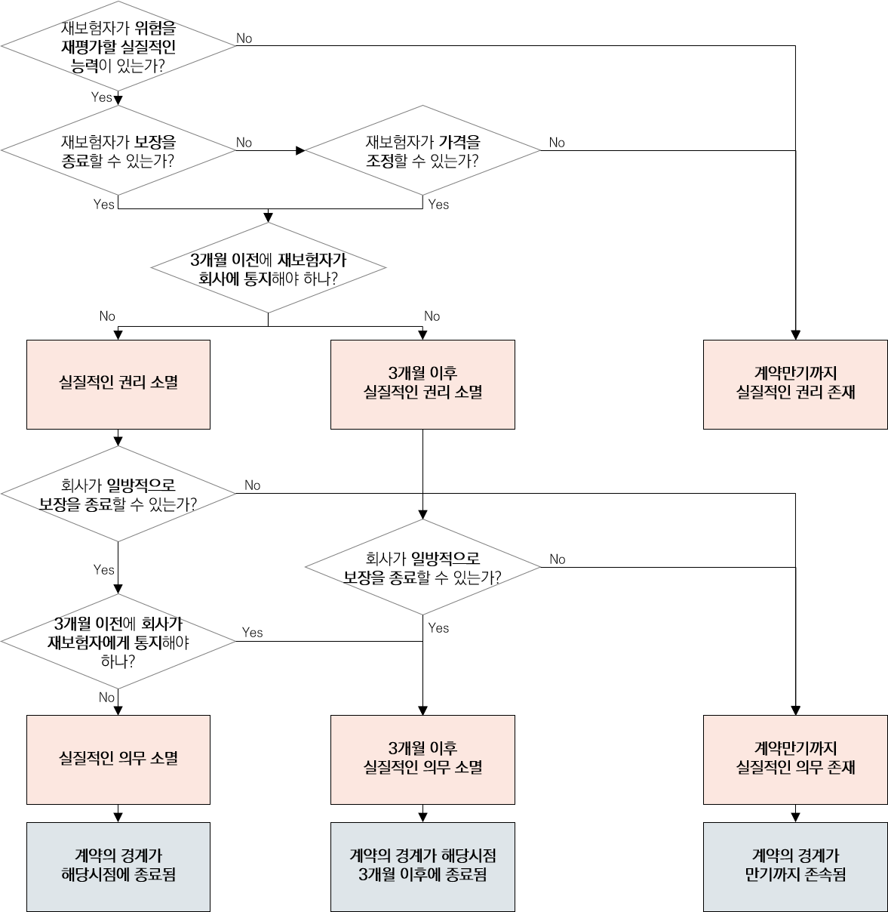
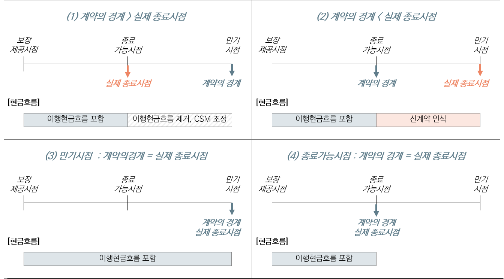
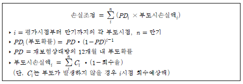
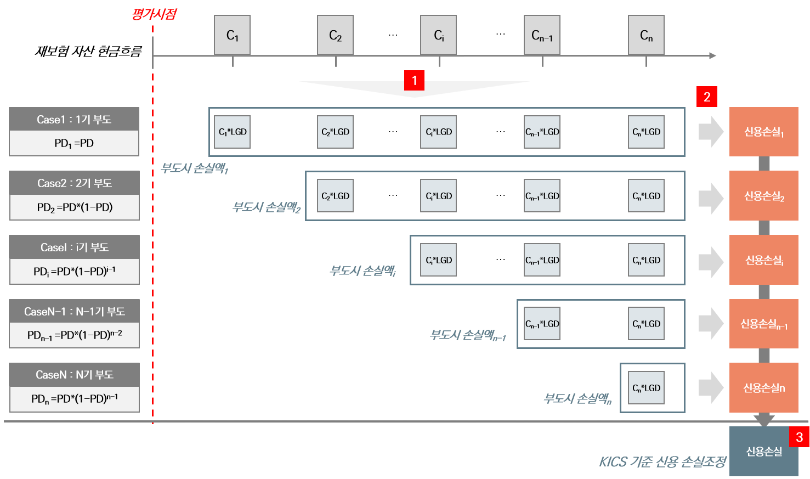
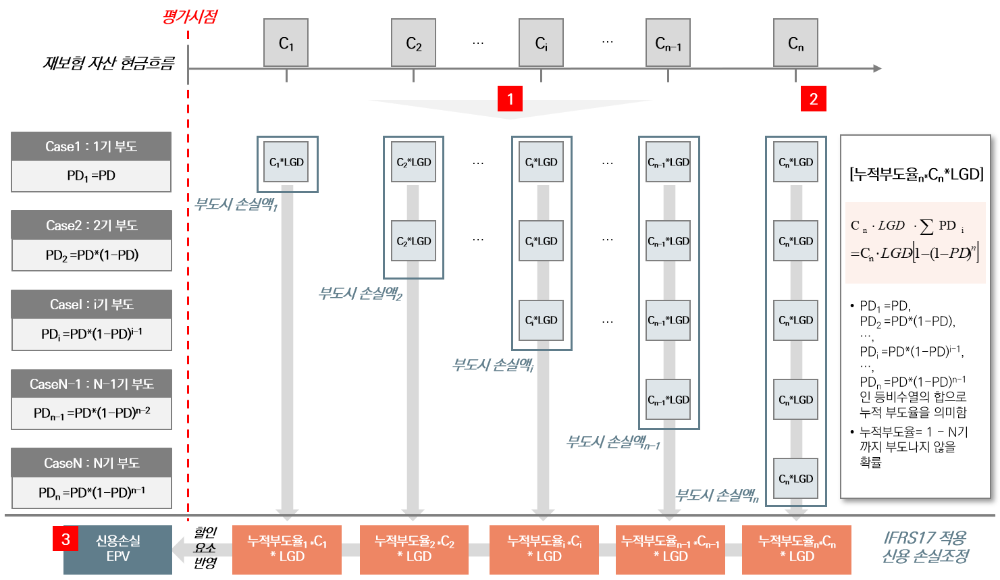
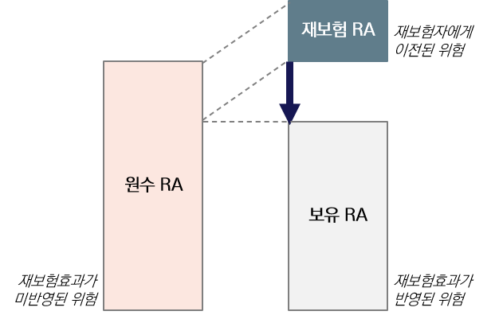

# 7.2.3 이슈사항 분석

최초인식시점의 출재보험계약집합은 원수보험계약집합과 같이 이행현금흐름과 보험계약마진의 합으로 측정해야 하므로 미래 현금흐름의 현재가치 추정치, 비금융위험에 대한 위험조정 측정 등에 있어 원수보험계약집합의 측정방법을 따르는 것이 원칙임. 그러나 재보험계약의 계약조건이 정형화되어 있지 않고, 재보험계약의 특성 및 계약상 옵션을 이행현금흐름에 반영해야 함에 따라 다음과 같은 실무적인 이슈가 발생할 것으로 예상됨.


* 계약의 경계 판단&#x20;
* 미래현금흐름의 현재가치 추정치 \
  : 미래 현금흐름 추정, 할인율 적용&#x20;
* 재보험자의 불이행(신용) 위험
* 비금융위험에  대한 위험조정&#x20;


## 계약의 경계&#x20;

일반적인 보험계약의 경계는 보장서비스를 제공한 실질적인 권리와 의무가 존재하는 기간까지로, 여기에서 실질적인 권리란 보험료를 수령할 권리이고 실질적인 의무란 보험금 등 급부를 지급할 의무를 의미함. 원수보험계약에서 보장을 제공할 실질적 의무는 기업에게 특정 보험계약자 또는 포트폴리오의 위험을 재평가할 실제적인 능력이 있으며 그러한 위험을 완전히 반영한 가격 또는 급부의 수준을 결정할 수 있는 때에 종료됨.&#x20;

출재보험계약집합은 원수보험계약집합과 같이 문단 32에 따라 이행현금흐름과 보험계약마진의 합계로 측정되므로 재보험계약에서 계약의 경계는 원수보험계약의 계약의 경계 기준을 적용해야 하는 것처럼 인식될 수 있으나, 원수보험계약과 재보험계약 간의 최초인식일이 달라 두 계약의 계약의 경계가 다를 수 있으며 원수보험계약의 기준서 문단을 그대로 적용 가능한지에 대한 이슈가 있음. TRG Meeting 에서는 재보험계약의 경계를 어떻게 적용할 것인가에 대해 여러번 논의하였으며, 요약하면 다음과 같음&#x20;

*   2018년 2월 TRG&#x20;

    * 출재보험계약에서 보장을 제공받을 실질적인 권리는 재보험자에게 당해 계약의 위험을 재평가할 실제적 능력이 있으며, 재보험자가 그러한 위험을 완전히 반영한 가격 또는 급부의 수준을 결정할 수 있거나 보장을 종료할 수 있는 때에 종료됨&#x20;
    * 이에 따라 미래에 발행될 것으로 예상되며 재보험에 의해 보장된 원수보험계약과 관련된 현금흐름도 재보험계약의 계약의 경계 범위 안에 포함될 수 있음

*   2018년 5월 TRG

    * 재보험자에 의한 가격조정이 가능한 시점에 실질적인 권리가 소멸하나, 재보험자가 가격조정을 하지 않은 경우 계약이 존속되며, 재보험자의 선택을 회사가 통제할 수 없으므로 실질적인 의무는 만기까지 존속된다는 결론을 내림&#x20;
    * 따라서 실질적인 권리는 3개월 이후에 소멸하지만 실질적 의무는 만기까지 남아있기 때문에 재보험계약의 경계를 결정할 원수보험계약을 확정하는 기간은 만기에 해당함&#x20;

* &#x20;2018년 9월 TRG
  * IFRS 17의 계약의 경계를 위한 판단은 하나이며, 원수보험계약과 출재보험계약에 일관된 기준이 적용됨&#x20;

> **\[참고] 2018년 2월 TRG "출재보험계약의 계약의 경계"**&#x20;
>
> _Review of accounting requirements_
>
>
>
> 10\. The staff observe that in reading paragraph 34, and other paragraphs of IFRS 17 when relevant, for the purpose of applying them to reinsurance contracts held, the words should be adapted in a way that is appropriate for reinsurance contracts held. For reinsurance contracts held, premiums are paid rather than received and services are received rather than provided. This observation is consistent with paragraph 4 of IFRS 17.&#x20;
>
> 11\. The staff view is that the cash flows within the boundary of the reinsurance contract held arise from the substantive rights and obligations of the entity i.e. the holder of the contract. The substantive right is to receive services from the reinsurer. The substantive obligation is to pay amounts to the reinsurer.&#x20;
>
> 12\. Consistently, a substantive right to receive services from the reinsurer ends when the reinsurer has the practical ability to reassess the risks transferred to the reinsurer and can set a price or level of benefits for the contract to fully reflect the reassessed risk.&#x20;
>
> 13\. Therefore, the staff observe that a substantive right of the reinsurer to terminate the coverage would result in the entity not having the substantive right to receive service. Also, the reinsurer’s practical ability to reassess the risks based on the claims experience of the reinsured contracts and to set a premium or level of benefits to fully reflect the reassessed risk means that the entity’s substantive right to receive service from the reinsurer ends.&#x20;
>

> **2018년 5월 TRG "가격 재산정이 가능한 보유하고 있는 재보험계약의 계약의 경계"**&#x20;
>
> _Review of accounting requirements_
>
>
>
> 15\. The TRG also observed that for some reinsurance contracts, the reinsurer can terminate the coverage at any time with a three month notice period. In these circumstances, the contract boundary would exclude cash flows arising from the reinsurance contract held that are related to underlying insurance contracts issued outside of that three month notice period because the entity no longer has a right to receive services from the reinsurer.&#x20;
>
> 16\. The staff observe that the above observations are valid in the context of assessing when the substantive right to receive services from the reinsurer ends. The discussion at the TRG was based on a fact pattern where no substantive obligation to pay premiums to the reinsurer exists, and therefore TRG members did not discuss this aspect of the requirements of paragraph 34 of IFRS 17. The fact pattern in this paper considers when the entity must continue to pay premiums to the reinsurer if the reinsurer does not reprice the contract.&#x20;
>
> 17\. The staff view is that a right to terminate coverage that is triggered by the reinsurer’s decision to reprice the reinsurance contract is not relevant when considering whether a substantive obligation to pay premiums exists. Such a right is not within the entity’s control and therefore the entity would continue to be compelled to pay premiums for the entire contractual term.&#x20;
>

> **\[참고] 2018년 9월 TRG "계약의 경계 관련"**
>
> _Example 3—Proportional reinsurance contract held_
>
>
>
> A12. The reinsurance contract held:&#x20;
>
> (a) is issued and recognised on 1 January;&#x20;
>
> (b) covers a proportion of all risks arising from underlying insurance contracts issued in a 24-month period (ie the entity transfers to the reinsurer a proportion of the premiums from the underlying insurance contracts and the reinsurer reimburses to the entity the same proportion of claims arising from underlying insurance contracts); and&#x20;
>
> (c) provides the unilateral right to both the entity and the reinsurer to terminate the contract with a three month notice period to the other party with respect to new business ceded only.&#x20;
>
>
>
> A13. At initial recognition, the entity buying the reinsurance contract concludes that cash flows within the reinsurance contract boundary are those arising from underlying contracts expected to be issued and ceded within a three month period. Since the reinsurer can terminate the coverage with respect to new business ceded with three months notice, the entity has no substantive right to receive services with respect to new business expected to be ceded after a three month period. Cash flows related to the underlying insurance contracts expected to be issued and ceded in the last 21 months of the reinsurance contract are outside the contract boundary and are therefore related to a future reinsurance contract(s).&#x20;
>
> A14. The entity’s reporting date is 31 March. At 31 March, neither the entity nor the reinsurer has given notice to terminate the reinsurance contract with respect to new business ceded.&#x20;
>
> A15. Applying paragraph B64 of IFRS 17 would not cause a reassessment of the contract boundary since the contract boundary determination at initial recognition was not based on an assessment of the practical ability to set a price that fully reflected the risks in the contract. Applying paragraph 35 of IFRS 17, the cash flows related to underlying contracts that are expected to be issued and ceded in the next three month period are cash flows outside the existing contract boundary as at 31 March and relate to a future reinsurance contract(s) held. That (future) contract would be recognised applying paragraph 62 of IFRS 17 and the cash flows within the boundary of that contract would be determined on this date applying paragraph 34 of IFRS 17.&#x20;
>
> A16. One submission raises a concern that applying this approach may result in daily reinsurance contracts being recognised for every day passing without either party exercising its termination rights with respect to new business ceded. However, the staff observe that reinsurance contracts held are recognised only when the recognition criteria in paragraph 62 of IFRS 17 are met. In the fact pattern provided, this is likely to be 1 April or later. The contract boundary is determined at the date of initial recognition, applying paragraphs 32–35 of IFRS 17. In this example, this will result in a new reinsurance contract held being recognised after the end of the first three month period with a contract boundary of cash flows arising from contracts expected to be ceded in the following three months—ie at 1 April the measurement of the first reinsurance contract held would reflect the coverage on the underlying contracts issued and ceded from 1 January to 31 March and the measurement of the second reinsurance contract held would reflect coverage on the underlying contracts expected to be issued and ceded in the period from 1 April until 30 June. Subject to paragraph 16 of IFRS 17, all of these reinsurance contracts held could belong to an annual group of contracts applying the level of aggregation criteria.&#x20;
>
> A17. The submission includes an additional fact pattern in which there is (or there is not) a unilateral right for the reinsurer to amend the rate of the ceding commission&#x20;
> it pays, in addition to the unilateral termination rights. The submission notes a possible view that a contract extended with repricing might be accounted for differently if extended without repricing. The staff observe that in this fact pattern, the existence of the right to terminate the contract with a three month notice period determines the cash flows within the contract boundary regardless of the existence of a right to amend the rate of the ceding commission if the contract is not terminated. Therefore, the same accounting would be applied to the additional fact pattern provided. ****
>

TRG에서 논의된 것과 같이 재보험계약의 계약의 경계는 계약으로 인한 실질적인 권리 및 의무를 모두 고려하여 판단해야 하며, 이 두 가지가 모두 소멸될 때에만 계약의 경계가 종료되며, 하나만 소멸될 때에 계약의 경계는 존속되는 것으로 인식해야 함.&#x20;

다만, 재보험계약은 계약조건이 정형화되어 있지 않아 발행자와 보유자의 권한이 계약마다 다양하고 문단 2에서 규정한 바와 같이 계약조건은 서면 뿐 아니라 구두, 관행, 법 규정 등 다양한 형식을 가질 수 있으므로 재보험계약의 계약조건 상의 실질적인 권리 및 의무에 따라 계약의 경계가 결정됨. 이를 고려하여 계약의 경계를 판단하는 프로세스는 다음과 같음.&#x20;

재보험사가 3개월 간의 사전 통지를 통해 보장을 종료하거나 보험료를 조정할 수 있다면 실질적인 권리와 의무는 인식시점부터 3개월간 존속되나, 사전 통지없이 보장기간 중에 아무 때나 보장을 종료하거나 보험료를 조정할 수 있다면 실질적인 권리와 의무는 존속하지 않을 것임.&#x20;

만약 재보험계약과 관련된 모든 보장을 소멸시킨다면, 종료 시점 이후에 발생하는 모든 현금흐름을 이행현금흐름에서 제외해야 하며, 보장의 종료가 향후 발행될 원수보험계약과 관련된 보장만 소멸시킨다면, 미래 발행될 원수보험계약과 관련된 현금흐름만 이행현금흐름에서 제외하고 이미 발행된 원수보험계약과 관련된 현금흐름은 계약의 경계 안에 있으므로 이행현금흐름에 포함함. 또한 계약의 경계 시점에 보장이 종료되거나 보험료가 조정되지 않는 경우 추가되는 현금흐름은 신계약으로 처리하고 기존 계약의 경계는 변경하지 않음. &#x20;

국제계리사회와 호주계리사회에서 계약의 경계는 계약의 당사자의 실질적인 권리와 의무 관점에서 결정되며, 재보험계약의 특성을 반영하고 평가에 사용된 특약서 상 포함된 계약상 옵션(신계약 Recapture, 사전 통지의무, 복원 등) 행사여부를 반영해야 한다는 의견을 제시하였으며, 관련하여 생명보험협회와 한국보험계리사회에서는 다음과 같은 의견을 제시함.&#x20;


**재보험계약의 계약의 경계 판단기준**

* 최소 계약 단위별 Treaty에 따라 계약의 경계 판단&#x20;
  * 방안 1) 협약서 별로 중단옵션(Recapture 조항)이 존재하는 경우&#x20;
    * 재보험사는 합의가 없더라도 협약서 조건에 따라 계약의 경계를 판단해야 하며, 조건에 따라 상의하게 정의
    * 재보험자 혹은 회사 중 하나가 출재 중단옵션 존재시, 계약의 경계는 원수보험계약 만기까지 포함&#x20;
    * 재보험자 혹은 회사 모두 출재 및 수재 중단옵션이 있는 경우, 양측 모두의 옵션 권한이 발생하는 시점까지 계약의 경계가 단절됨&#x20;
  *   &#x20;방안 2) 협약서 별로 중단옵션(Recapture 조항)이 존재하지 않는 경우

      * 재보험계약의 계약의 경계는 원수보험계약의 만기로 설정하는 것이 타당
      * 일반적으로 재보험계약은 매년 갱신되는 형태로 체결되나, 갱신시점에 쌍방 합의 없이는 가격 재설정 불가
      * 재보험자와 회사의 합의 하에 재보험계약을 중단하지 않기로 했다면 원수보험계약의 만기까지 재보험계약을 유지&#x20;

*   중단옵션(Recapture 조항)과 무관하게 원수만기에 따른 계약의 경계 판단&#x20;

    * Treaty 계약 시 만기일을 명시하고 재보험 조건을 재검토할 수 있는 권한이 있다 하더라도 원수사 입장에서 재보험사를 통제 및 조정하는 것이 불가능하므로  재보험사로부터 서비스를 받을 실질적인 권리가 Treaty 만기일에 종료된다고 보기 어려움&#x20;
    * 따라서 재보험계약의 계약의 경계를 원수보험계약의 만기일까지로 설정해야 함

    &#x20;
* 미래 신계약의 반영여부 판단&#x20;
  * 재보험계약서 상 신계약 출재 중단 가능성이 있는 시점까지 신계약을 계약의 경계에 포함&#x20;
    * 원수보험사 혹은 재보험사 중 어느 일방이 일정 시점 이후 계약해지를 사전 통보하면 해당 시점에 신계약 재보험계약이 종료되는 계약의 경우, 해당 시점까지 신계약을 계약의 경계에 포함
    * 원수보험사 혹은 재보험사 모두에게 즉시 계약을 해지할 권한이 있는 경우 미래 신계약 물량의 반영은 불필요함&#x20;
  * 미래 신계약은 합리적인 방법으로 미래 신계약에 해당하는 모델포인트를 추가반영하여 현금흐름 생성&#x20;
    * 예시 \
      : 미래 신계약은 당월 신계약을 복제하여 생성한 후 포트폴리오 속성을 조정하여 반영&#x20;
    * 상품 판매종료 예정, 신상품 출시, 신계약비 정책 변경 등으로 물량이 크게 변동할 것으로 예상되는 경우 해당 효과 반영 가능  &#x20;


한편, 재보험계약의 조건으로 인해 현금흐름 추정 시 결정된 계약의 경계와 실제 계약이 종료된 시점이 일지하지 않은 경우가 발생할 수 있는데, 다음과 같이 상황에 따른 판단이 필요함. &#x20;

*   계약의 경계 > 실제 종료시점&#x20;

    * 계약의 경계가 만료되어 계약을 제거해야 하므로 실제 종료시점 이후의 현금흐름을 이행현금흐름에서 제거하고 그 변동액을 보험계약마진에서 조정&#x20;

*   계약의 경계 < 실제 종료시점&#x20;

    * 국제계리사회와 호주계리사회는 원래의 계약의 경계를 실제 만기까지 확장하고 그 효과를 이행현금흐름으로 반영하는 방법과 새로운 계약의 경계를 지닌 신규 계약으로 처리하는 방법이 있다는 의견을 제시함&#x20;
    * 이와 관련하여 TRG Staff 및 다수 의원은 기존 계약의 경계를 바꾸지 않고 추가되는 현금흐름 만큼을 신계약으로 보아야 한다고 주장하며, 이는 계약의 변경에 해당하는 상황이 아니라는 의견을 제시함&#x20;
    * 따라서 당초 계약의 경계 밖에 있던 현금흐름이 발생하는 경우 추가되는 현금흐름 만큼은 신규계약으로 인식하는 것이 타당함&#x20;

*   만기시점 : 계약의 경계 = 실제 종료시점&#x20;

    * 계약만기까지 계약이 존속되므로, 계약의 종료시점까지 추가적인 회계처리 필요없음&#x20;

* 종료가능시점 : 계약의 경계 = 실제 종료시점&#x20;
  * 당초 측정시부터 종료가능시점 이후 만기시점까지의 현금흐름이 이행현금흐름에 포함되어 있지 않으므로 계약이 종료된 시점에 추가적인 회계처리 불필요&#x20;

## 미래 현금흐름의 현재가치 추정치&#x20;

출재보험계약집합에 대한 미래 현금흐름의 현재가치 추정치를 측정할 때는 원수보험계약집합에 대한 미래 현금흐름의 현재가치 추정치를 측정할 때와 일관된 가정을 사용하는 것이 원칙임. 따라서 출재보험계약집합에 대한 미래 현금흐름은 이용할 수 있는 모든 정보를 중립적으로 사용하여 시장정보와 일관되게 추정해야 하며, 보고시점에서의 현행추정치로 명시적으로 추정해야 함.&#x20;

다만, 기준서에서 제시한 원칙에 따라 출재보험계약집합의 미래 현금흐름의 현재가치를 추정하기에는 재보험계약의 특성과 계약상 옵션을 반영해야 한다는 점에서 실무적인 적용방법이 필요할 것으로 판단됨.&#x20;

호주계리사회에서는 재보험계약의 현금흐름 추정 시, 재보험 특약이 유효하고 요율 재산정으로 인하여 계약의 경계 밖에 속하지 않는다면 원수보험계약의 예상 신계약 물량을 잠재적으로 포함하고, 재보험 계약상 옵션의 효과를 포함할 경우에는 경제적 이익에 따라 원수사/출재사 각각 해당 옵션을 행사한다고 가정하는 것이 적절하며 경제적 이익은 평가에 사용된 최적가정을 기반으로 결정해야 한다는 의견을 제시함.&#x20;

생명보험협회에서는 원수보험계약의 Input Data와 재보험가정(출재율, 출재보험료, 출재수수료율 등)을 사용하여 현금흐름을 추정하며, 일반적으로 재보험계약의 경우 투자요소가 존재하지 않을 것이며, 보험계약대출도 존재하지 않으므로 원수보험계약에 비해 필요 가정이 단순할 것이며, 다음과 같이 구성되고 건 별로 산출하여 적용해야 한다는 의견을 제시함.&#x20;

한편, 한국보험계리사회는 재보험계약의 정산단위보다 보험계약집합이 세분화되어 있는 경우 현금흐름 포함항목인 이익수수료 및 손해분담금을 어떻게 반영해야 하는지에 대해 다음과 같은 방안을 제시함&#x20;


#### \[방안 1]

* 재보험 정산단위(Treaty) 별로 이익수수료를 산출하고, 동일하게 보험계약집합 별로 이익수수료를 계산하여 보험계약집합 별 이익수수료(또는 재보험료 - 재보험금)을 Driver로 재보험 정산단위 별 이익수수료 배분&#x20;
  * 보험계약집합 별 이익수수료 금액 비율로 이익수수료 총액 배분&#x20;
  * 보험계약집합 별 음의 이익수수료는 그대로 살려서 계산&#x20;
  * 정산단위 이익수수료가 0인 경우 적절한 분리를 통해 이익수수료가 양(+)인 부분을 산출 후, 음(-)인 부분에 배분&#x20;

#### \[방안 2]

* 재보험사의 직전 3년간 이익수수료 반영 후 평균순이익률을 기초로 평균순이익률 충족을 위한 이익수수료를 역산하여 반영&#x20;
  * 예상이익수수료 : 개별 계약(모델포인트) 별로 산출&#x20;
  * 실제이익수수료 : 평균 순이익률을 적용하여 산출된 금액 기준으로 보험계약집합에 배분&#x20;

#### \[방안 3]

* 원수보험계약에 적용된 손해율 가정을 일관되게 적용하되, 재보험계약의 조건에 따라 이익수수료율을 평가하여 산출함.&#x20;
  * 재보험계약의 조건에 따라 한도 등이 발생하는지 여부와 그에 따른 현금흐름의 가정에 부합하는 이익수수료율을 산출하여 평가&#x20;
  * 별도의 배분없이 보험계약집합별로 동일 이익수수료율 적용&#x20;


또한 생명보험협회에서는 일반적으로 재보험의 경우 투자요소가 존재하지 않을 것이라 판단한 반면,  한국보험계리사회에서는 재보험사가 모든 상황에서 재보험 계약자에게 지급할 최소 금액으로 투자요소를 정의함. 다만, 투자요소는 정의에 부합하도록 특약의 내용에 맞게 해석하여 산출방법을 결정해야 하나, 일반적으로 재보험료 금액에 이익수수료율을 반영한 금액을 투자요소로 인식할 것을 제안하며 다음과 같은 의견을 제시함. &#x20;


* 임의 재보험은 정산/이익에 따른 투자요소 발생이 사실상 없으므로 특약 재보험에 한해 적용&#x20;
* 이익수수료는 지급된 재보험과 반비례 관계가 존재하므로, 손해율이 0인 경우의 이익정산수수료를 투자요소로 정의&#x20;
* 분기별 보험수익 및 보험서비스비용에서 투자요소를 차감하여 표시하되, 차감할 투자요소는 분기별 보험료 등 Driver에 따라 배분하거나 분기별 누적 투자요소를 직접 산출하여 배분함


한편, 재보험계약에 적용하는 할인율은 원보험계약에서 적용하는 할인율 가정과 일관되게 적용하는 것이 원칙임. 이와 관련하여 국제계리사회에서는 원수보험계약 가정과의 일관성에 대하여 원수보험계약과 재보험계약 간의 유사한 특성을 공유하는 정도를 요구할 뿐 동일한 가정의 사용을 반드시 요구하지 않으며, 공동인수계약에 대해서는 사전에 정해진 비율대로 출재하므로 원수보험계약 및 재보험계약이 동일한 유동성 프리미엄을 가지나 사망위험 재보험계약에 대해서는  재보험계약이 더 유동적이라는 의견을 제시함.&#x20;

## 재보험자 불이행(신용)위험&#x20;

출재보험계약집합에 대한 미래 현금흐름의 현재가치 추정치에는 재보험자의 부도, 담보로 인한 효과 및 분쟁으로 인한 손실을 포함하여 재보험계약의 불이행과 관련된 모든 위험을 포함할 것을 원칙으로 함. 이 때 재보험자의 현 재무상태, 신용등급 및 시간에 따른 변경가능성을 반영해야 함.&#x20;

기준서에서는 기대신용손실을 추정하여 미래 현금흐름의 현재가치 추정치에 반영해야 한다는 원칙만을 제시할 뿐 구체적인 적용방안에 대해서는 언급하고 있지 않음. 이에 대하여 호주계리사회에서는 재보험계약 평가시 시장에서 거래되는 동일한 신용등급의 채권 할인율을 이용하고 부도위험을 반영하기 위해 할인율에 스프레드를 적용하는 방법과 부도율과 손실율을 이용한 예상손실을 현금흐름에서 조정하는 방법을 제안하였으나 구체적인 방법에 대해서는 언급하지 않음.&#x20;

新지급여력제도에서는 재보험 계약의 현금흐름에 손실조정 반영을 위하여 구체적인 손실조정 계산식을 제시함. 新지급여력제도 기준상 손실조정은 재보험 거래상대방의 장래 부도확률, 부도에 따른 손실 및 손실 회수금액을 감안하고 화폐의 시간가치를 반영하여 측정하므로 이를 준용하여 IFRS 17 기준의 기대신용손실을 측정해야 함. 따라서 다음의 식과 같이 재보험자의 신용등급 및 부도확률 등을 고려하여 현금흐름 발생시기 별로 PD/LGD 및 화폐의 시간가치를 고려하여 각 시점의 기대신용손실액을 추정하여 현금흐름에 반영해야 함.&#x20;

* 재보험 거래상대방의 장래부도에 따른 손실금액을 현금흐름에 반영&#x20;
* 재보험 거래상대방의 부도시 회수 가능금액을 추정하여 현금흐름에 반영할 때 회수율을 보험회사의 합리적인 가정을 사용하여 추정하되 그 값은 50% 이하로 제한함&#x20;
* 재보험 거래상대방의 부도확률은 적격 외부신용평가기관의 신용등급별 부도확률을 적용할 수 있음

> **\[참고] 新지급여력제도(K-ICS 4.0)**
>
> _**K--ICS 신용등급 적용기준**_&#x20;
>
> (1) K-ICS 신용등급은 국내외 적격외부신용평가기관(이하 '신용평가기관'이라 한다)의 신용등급을 직접 매핑하거나 신용평가기관의 공시 등급부도율을 기준으로 신용평가기관의 신용등급을 매핑하여 산출한다.&#x20;
>
> ① 국내 적격외부신용평가기관이란, 「은행감독업무시행세칙」 \[별표3] 제 2장 제2절에서 정하는 기준에 따라 감독원장이 지정하는 신용평가기관을 말한다.
>
> ② 국외 적격외부신용평가기관이란, 다음에 해당하는 기관을 말한다.&#x20;
>
> &#x20;   ㄱ. 국제 3대 신용평가기관(S\&P, Moody’s, Fitch)
>
> &#x20;   ㄴ. 바젤은행감독위원회 회원국 금융감독당국이 지정한 적격외부신용평가기관(ECAI)
>

만일, 재보험 거래상대방이 최근 3년간 해외 신용평가기관으로부터 A등급(S\&P기준) 이상 또는 이에 준하는 신용등급 이상을 받는 경우 다음에서 정한 간편법으로 기대신용손실을 반영할 수 있음.

다만, 新지급여력제도에서 제시한 원칙에 따라 할인효과를 반영하기 위해서는 매 부도시점 금액산출시 각각의 Ci x LGD 값 별로 현재가치 산출 후 합산하여 부도시 손실액을 산출하고, 부도시손실액에 시점별 부도율을 곱하여 손실조정금액을 산출하고 매기 손실조정금액을 합산해야 손실조정금액을 산출할 수 있음. 해당 방식은 시점별 할인효과를 반영하기 어렵다는 단점이 있으므로 각 시점별 손실조정액을 산출한 후 할인요소를 반영하여 손실조정 기대현금흐름의 현재가치를 산출하는 방식을 적용하는 것이 적절함.

## 비금융위험에 대한 위험조정

출재보험계약집합의 위험조정은 문단 37 대신 출재보험계약집합의 보유자가 해당 계약의 발행자에게 이전하는 위험을 반영하도록 산정하는 것을 원칙으로 하나, 기준서에서는 원수보험계약에 대한 위험조정 산출방법론을 규정하지 않았으며, 재보험계약 역시 구체적인 산출방법론을 규정하지 않음. 다만, 정의에 따르면 출재보험계약집합의 위험조정은 이전 대상이 필요하므로 원수보험계약의 위험조정과 별도로 산출될 수 없음.&#x20;

이에 대하여 호주계리사회에서는 개념적으로 재보험의 보유여부에 따른 위험 포지션의 차이로 결정되며, 실무적으로 출재를 많이 할 경우, 회사의 원수 위험성향을 평가하기 곤란할 수 있으므로 보유기준의 위험조정을 먼저 평가하고 재보험계약의 위험조정을 반영하여 원수보험계약의 위험조정을 역으로 산출가능하다는 의견을 제시함.&#x20;

* 개념적으로 보유 위험조정은 원수보험계약에서 재보험계약의 위험조정을 차감하여 결정되므로, 회사의 보유 위험성향을 기반으로 상기 산식이 성립하지 않을 경우 재보험계약의 위험조정이 이전된 위험을 적절하게 반영하지 못할 수 있음&#x20;
* 다만, 측정기준이 상이할 경우 원수보험계약 포지션과 보유기준 표지션의 차이로 재보험계약의 위험조정을 결정할 수없음&#x20;

한편, 한국계리사회에서는 출재보험계약집합의 현금흐름 변동성만으로 위험조정을 산출하는 것이 원칙이나 다음과 같은 실무적용방안을 제시함.&#x20;


**\[방안 1]**

* 원수보험계약의 위험에 근거하여 출재 및 보상이 이루어지므로 동일한 가정방법론을 적용하여 재보험계약만의 위험조정을 산출&#x20;
  * 재보험계약의 현금흐름에 원수보험계약과 동일한 위험조정 산출방법 적용
  * 단, 사업비는 출재대상 위험이 아니므로 재보험계약 위험조정 측정에서 제외함&#x20;

**\[방안 2]**

* 원수보험계약과 재보험계약의 현금흐름 반영기간 및 평가대상이 일치하는 경우, 원수보험계약의 위험조정에서 보유 위험조정을 차감하여 재보험계약의 위험조정을 산출가능&#x20;
  * 원수보험계약 기준의 위험조정과 원수보험계약에 재보험 현금흐름을 반영한 보유기준으로 산출한 결과값에 차액을 재보험계약의 위험조정으로 정의하는 방안&#x20;
  * 단, 호주계리사회의 의견처럼 원수보험계약과 현금흐름 반영기간 및 평가대상이 일치하지 않은 경우 충실한 반영이 불가능함&#x20;

